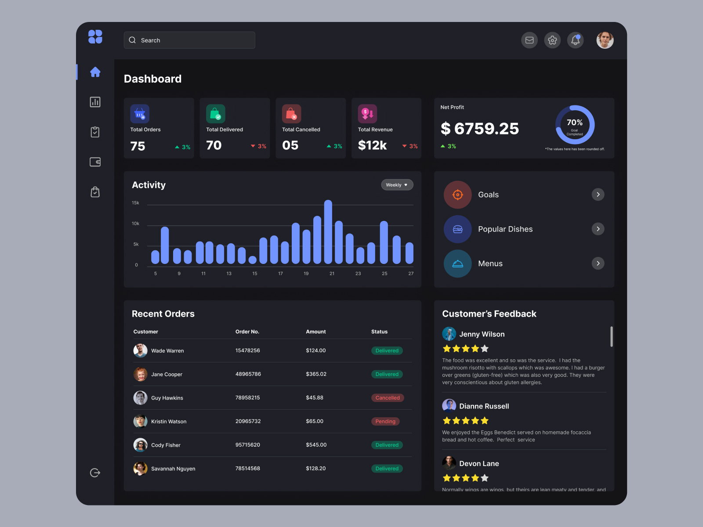

# FitPeo Dashboard



## Overview

FitPeo Dashboard is a responsive admin panel built with React and TailwindCSS. The dashboard is designed to provide an intuitive user experience with various metrics and data visualizations.

## Features

- **Dashboard Overview**: Displays total orders, total delivered, total canceled, total revenue, net profit, and more.
- **Activity Graph**: Shows activity metrics over time.
- **Recent Orders**: Lists recent orders with details like customer name, order number, amount, and status.
- **Customer Feedback**: Displays customer reviews and ratings.
- **Goals and Popular Dishes**: Provides quick access to goals, popular dishes, and menus.

## Tech Stack

- **Frontend**: React, TypeScript, TailwindCSS
- **Charts**: ECharts, echarts-for-react
- **Icons**: React Icons
- **Colors**: Coolers [Click here](https://coolors.co/palettes/popular/black)
- **Routing**: React Router DOM
- **State Management**: Lodash (for utility functions)
- **UI Components**: Headless UI (for unstyled accessible components)

## Getting Started

### Prerequisites

- Node.js (version 14.x or later)
- npm (version 6.x or later)

### Installation

1. Clone the repository:
   ```sh
   git clone https://github.com/koushikmaratha500/fitpeo-dashboard.git
   cd fitpeo-dashboard
   ```
2. Install the dependencies:
   ```sh
   npm i
   ```
3. Running the dev server:
   ```sh
   npm run start
   ```
4. Building for production:
   ```sh
   npm run build
   ```
5. preview the production build:
   ```sh
   npm run preview
   ```
